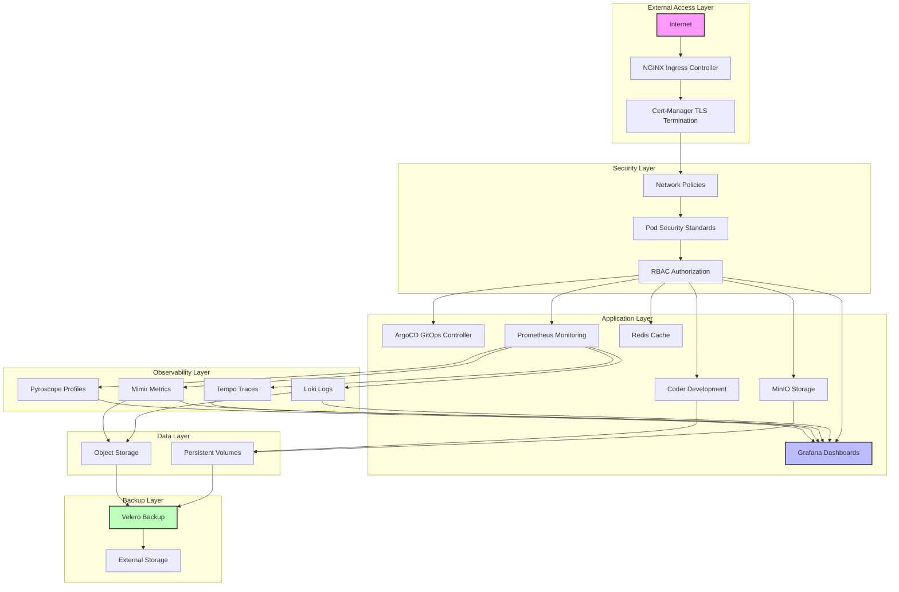
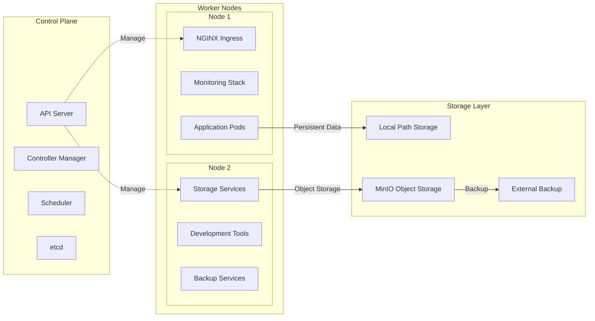
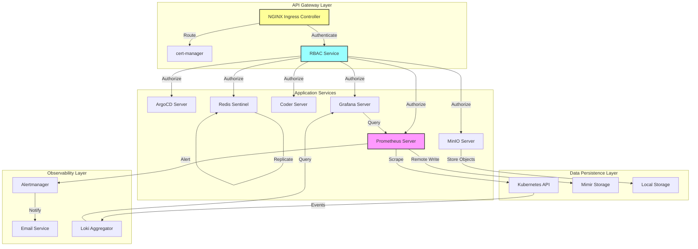
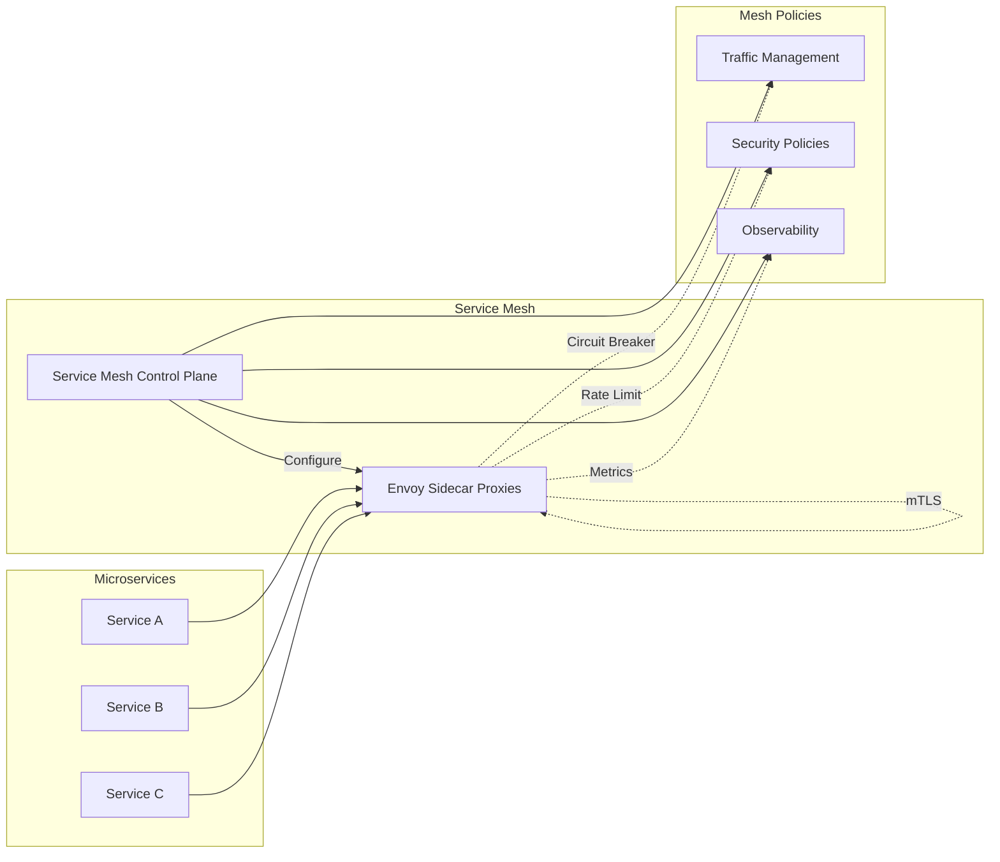
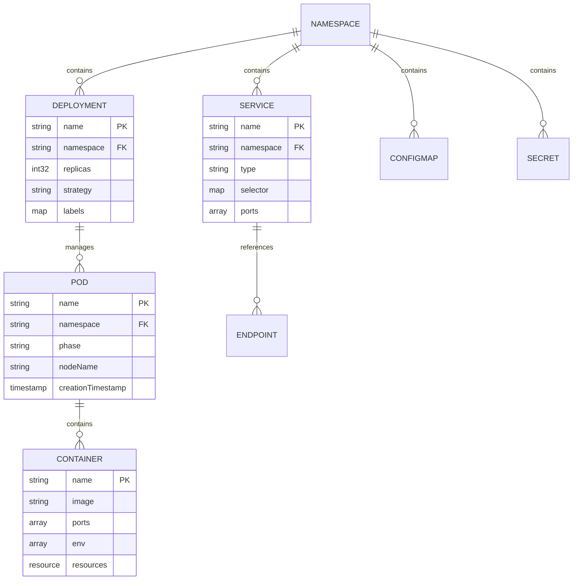
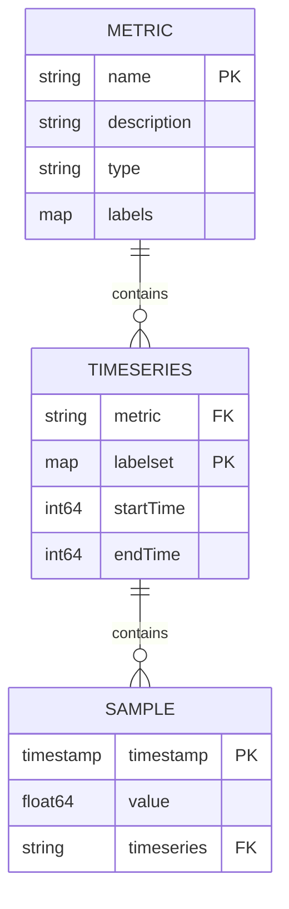
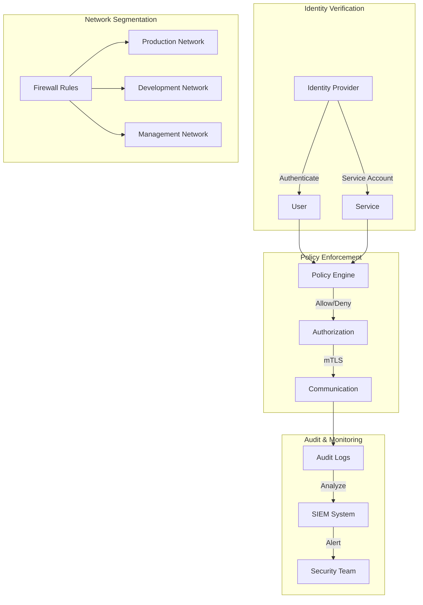
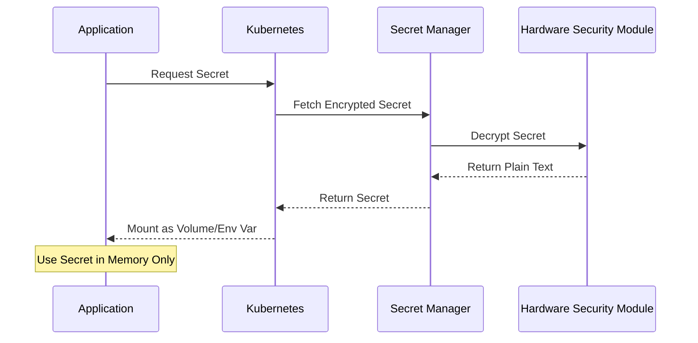
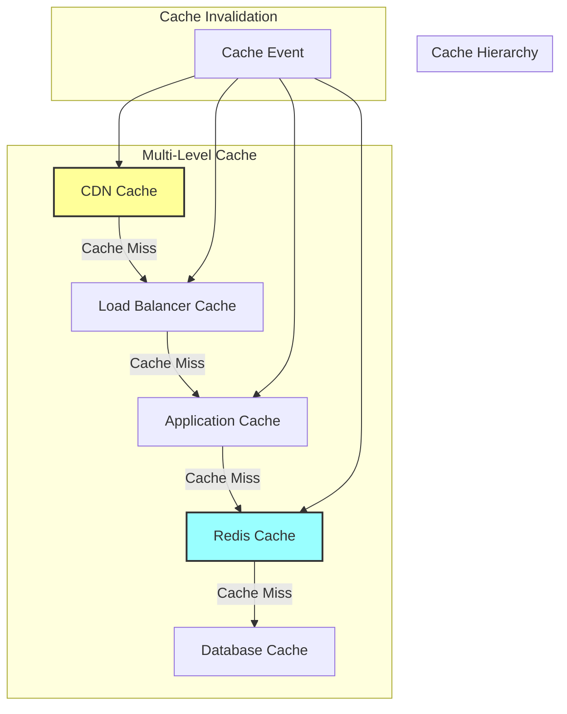

# Kubernetes Homelab - Technical Architecture

## 1. Architecture Design

### 1.1 High-Level Architecture



### 1.2 Network Architecture



## 2. Technology Description

### 2.1 Core Infrastructure Stack

* **Container Orchestration**: MicroK8s v1.28+

* **Container Runtime**: containerd

* **Service Mesh**: None (Keep It Simple)

* **Ingress Controller**: NGINX Ingress

* **Certificate Management**: cert-manager v1.13+

### 2.2 Frontend Technologies

* **Dashboard Interface**: Grafana v10+

* **Web Applications**: React-based (for custom tools)

* **Development Environment**: Coder v2+

### 2.3 Backend Technologies

* **Configuration Management**: ArgoCD v2.8+

* **Monitoring Backend**: Prometheus v2.45+

* **Log Aggregation**: Loki v2.9+

* **Metric Storage**: Mimir v2.10+

* **Distributed Tracing**: Tempo v2.2+

* **Continuous Profiling**: Pyroscope v1.4+

### 2.4 Data Storage

* **Block Storage**: Local Path Provisioner

* **Object Storage**: MinIO RELEASE.2024+

* **Cache Layer**: Redis v7+ with Sentinel

* **Backup Solution**: Velero v1.12+

### 2.5 Security Stack

* **Secret Management**: Sealed Secrets or External Secrets Operator

* **Network Policies**: Calico or Kubernetes NetworkPolicy

* **Pod Security**: Pod Security Standards (Restricted)

* **Vulnerability Scanning**: Falco or Trivy

* **RBAC**: Kubernetes RBAC with least privilege

## 3. Route Definitions

### 3.1 External Access Routes

| Hostname               | Service       | Port | Purpose                   |
| ---------------------- | ------------- | ---- | ------------------------- |
| `dashboard.home.arpa`  | Grafana       | 443  | Main monitoring dashboard |
| `prometheus.home.arpa` | Prometheus    | 443  | Metrics collection UI     |
| `minio.home.arpa`      | MinIO Console | 443  | Object storage management |
| `s3.home.arpa`         | MinIO S3 API  | 443  | S3-compatible API         |
| `coder.home.arpa`      | Coder         | 443  | Development environments  |
| `argocd.home.arpa`     | ArgoCD        | 443  | GitOps dashboard          |

### 3.2 Internal Service Discovery

| Service             | Namespace  | ClusterIP | Port  |
| ------------------- | ---------- | --------- | ----- |
| `prometheus-server` | monitoring | 10.43.x.x | 9090  |
| `grafana`           | monitoring | 10.43.x.x | 3000  |
| `minio`             | minio      | 10.43.x.x | 9000  |
| `minio-console`     | minio      | 10.43.x.x | 9090  |
| `redis-master`      | redis      | 10.43.x.x | 6379  |
| `redis-sentinel`    | redis      | 10.43.x.x | 26379 |

## 4. API Definitions

### 4.1 Monitoring APIs

#### Prometheus Query API

```
GET /api/v1/query
```

Request Parameters:

| Parameter | Type      | Required | Description                 |
| --------- | --------- | -------- | --------------------------- |
| query     | string    | true     | Prometheus expression query |
| time      | timestamp | false    | Evaluation timestamp        |
| timeout   | duration  | false    | Query timeout               |

Example Response:

```json
{
  "status": "success",
  "data": {
    "resultType": "vector",
    "result": [
      {
        "metric": {
          "__name__": "up",
          "job": "prometheus"
        },
        "value": [1234567890, "1"]
      }
    ]
  }
}
```

#### Grafana Dashboard API

```
POST /api/dashboards/db
```

Request Body:

```json
{
  "dashboard": {
    "title": "Production Overview",
    "panels": [
      {
        "title": "CPU Usage",
        "type": "graph",
        "targets": [
          {
            "expr": "100 - (avg by (instance) (irate(node_cpu_seconds_total{mode=\"idle\"}[5m])) * 100)"
          }
        ]
      }
    ]
  }
}
```

### 4.2 Storage APIs

#### MinIO S3 API

```
PUT /{bucket}/{object}
```

Headers:

| Header         | Required | Description          |
| -------------- | -------- | -------------------- |
| Content-Length | true     | Object size in bytes |
| Content-Type   | false    | MIME type of object  |
| x-amz-meta-\*  | false    | User metadata        |

#### Redis Commands

```
# Connection test
PING

# Key operations
SET key value [EX seconds] [PX milliseconds] [NX|XX]
GET key
DEL key [key ...]

# Hash operations
HSET key field value
HGET key field
HGETALL key
```

## 5. Server Architecture

### 5.1 Component Interaction Diagram



### 5.2 Service Mesh Integration (Future)



## 6. Data Model

### 6.1 Kubernetes Resource Model



### 6.2 Monitoring Data Schema



### 6.3 Configuration Management

```yaml
# Application configuration schema
apiVersion: v1
kind: ConfigMap
metadata:
  name: app-config
  namespace: default
data:
  # Application settings
  app.properties: |
    server.port=8080
    server.host=0.0.0.0
    
    # Database configuration
    db.host=postgres.database.local
    db.port=5432
    db.name=appdb
    
    # Redis configuration
    redis.host=redis.cache.local
    redis.port=6379
    
    # Monitoring configuration
    metrics.enabled=true
    metrics.endpoint=/metrics
    
    # Security settings
    security.cors.allowed-origins=https://app.home.arpa
    security.headers.content-security-policy=default-src 'self'
```

## 7. Security Architecture

### 7.1 Zero Trust Network Model



### 7.2 Secret Management Flow



## 8. Performance Architecture

### 8.1 Horizontal Scaling Pattern

```yaml
# Horizontal Pod Autoscaler configuration
apiVersion: autoscaling/v2
kind: HorizontalPodAutoscaler
metadata:
  name: app-hpa
spec:
  scaleTargetRef:
    apiVersion: apps/v1
    kind: Deployment
    name: app-deployment
  minReplicas: 3
  maxReplicas: 10
  metrics:
  - type: Resource
    resource:
      name: cpu
      target:
        type: Utilization
        averageUtilization: 70
  - type: Resource
    resource:
      name: memory
      target:
        type: Utilization
        averageUtilization: 80
  behavior:
    scaleUp:
      stabilizationWindowSeconds: 60
      policies:
      - type: Percent
        value: 100
        periodSeconds: 15
    scaleDown:
      stabilizationWindowSeconds: 300
      policies:
      - type: Percent
        value: 50
        periodSeconds: 60
```

### 8.2 Caching Strategy



This architecture provides a robust, scalable, and secure foundation for your Kubernetes homelab, incorporating industry best practices and modern cloud-native patterns.
